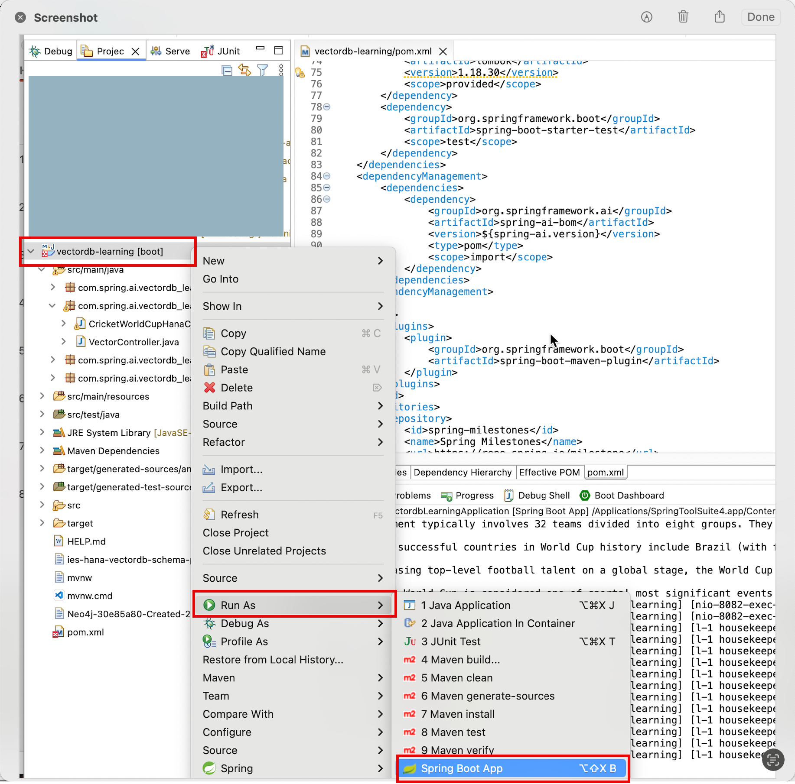
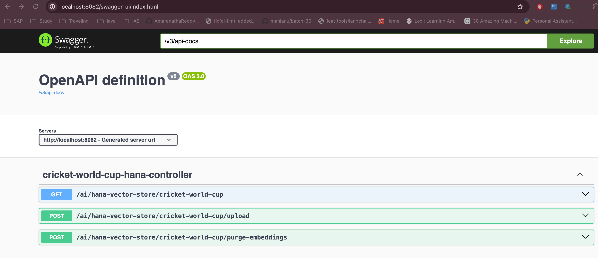

<h1 align="center">SpringAI VectorDB Learning</h1>

<p align="center">
    
</p>

<p align="center">
  <a href="#about">About</a> •
  <a href="#getting-started">Getting Started</a> •
  <a href="#vector-DB-integration">Vector DB Integration</a> •
  <a href="#start-application">Start Application</a> •
  <a href="#swagger-ui">Swagger UI</a> •
  <a href="#contributors">Contributors</a>
</p>

## About
SpringAI VectorDB Learning Repo you will learn SpringAI Integration with Vector database (SAP HANA, Neo4J), Provide the RestAPI endpoints to build the RAG Patterns. 

## Getting Started

This section offers jumping off points for how to get started using Spring AI.
You should follow the steps in each of the following section according to your needs.

#### Pre-Requisites 
- [Java17](https://www.oracle.com/java/technologies/javase/jdk17-archive-downloads.html)
- [Maven](https://maven.apache.org/install.html)
- [SAP HANA](https://docs.spring.io/spring-ai/reference/api/vectordbs/hanadb-provision-a-trial-account.html)
- [Neo4J](https://gamaranathareddy.github.io/LLM-RAG-Chatbot/neo4j/setup/)
- [Git](https://git-scm.com/downloads)
  

### Clone GIT Repo

Clone the repositoy from github account
```
git clone https://github.com/GAmaranathaReddy/springai-vectordb-learning.git
```

## Vector DB Integration

### Vector Database 
A vector databases is a specialized type of database that plays an essential role in AI applications.

In vector databases, queries differ from traditional relational databases. Instead of exact matches, they perform similarity searches. When given a vector as a query, a vector database returns vectors that are “similar” to the query vector. Further details on how this similarity is calculated at a high-level is provided in a Vector Similarity.

Vector databases are used to integrate your data with AI models. The first step in their usage is to load your data into a vector database. Then, when a user query is to be sent to the AI model, a set of similar documents is first retrieved. These documents then serve as the context for the user’s question and are sent to the AI model, along with the user’s query. This technique is known as Retrieval Augmented Generation (RAG).

The following sections describe the Spring AI interface for using multiple vector database implementations and some high-level sample usage.

The last section is intended to demystify the underlying approach of similarity searching in vector databases.

### Auto-configuration

Spring AI provides Spring Boot auto-configuration for the SAP Hana Vector Store. To enable it, add the following dependency to your project’s Maven pom.xml file:

```
<dependency>
    <groupId>org.springframework.ai</groupId>
    <artifactId>spring-ai-hanadb-store-spring-boot-starter</artifactId>
</dependency>

```
Please refer [HanaCloudVectorStore properties](https://docs.spring.io/spring-ai/reference/api/vectordbs/hana.html#_hanacloudvectorstore_properties) for vectory db configuration 

### Build a Sample RAG application

Shows how to setup a project that uses SAP Hana Cloud as the vector DB and leverage OpenAI to implement RAG pattern

- Create a table CRICKET_WORLD_CUP in SAP Hana DB:
   ```
   CREATE TABLE CRICKET_WORLD_CUP (
      _ID VARCHAR2(255) PRIMARY KEY,
      CONTENT CLOB,
      EMBEDDING REAL_VECTOR(1536)
     )
   
   ```
- Add the following properties in application.properties file:
  ```
  spring.ai.openai.api-key=${OPENAI_API_KEY}
  spring.ai.openai.embedding.options.model=text-embedding-ada-002

  spring.datasource.driver-class-name=com.sap.db.jdbc.Driver
  spring.datasource.url=${HANA_DATASOURCE_URL}
  spring.datasource.username=${HANA_DATASOURCE_USERNAME}
  spring.datasource.password=${HANA_DATASOURCE_PASSWORD}

  spring.ai.vectorstore.hanadb.tableName=CRICKET_WORLD_CUP
  spring.ai.vectorstore.hanadb.topK=3
  ```
- Create entity class
  ```

  @Entity
  @Table(name = "CRICKET_WORLD_CUP")
  @Data
  @Jacksonized
  @NoArgsConstructor
  public class CricketWorldCup extends HanaVectorEntity{
      @Column(name = "content")
      private String content;
  }
  
  ```
- Create a Repository named CricketWorldCupRepository that implements HanaVectorRepository interface:
  Please refer repo class [CricketWorldCupRepository](https://github.com/GAmaranathaReddy/springai-vectordb-learning/blob/main/src/main/java/com/spring/ai/vectordb_learning/repository/CricketWorldCupRepository.java)

- Now, create a REST Controller class CricketWorldCupHanaController, and autowire ChatModel and VectorStore as dependencies In this controller class, create the following REST endpoints:

  - /ai/hana-vector-store/cricket-world-cup/purge-embeddings - to purge all the embeddings from the Vector Store

  - /ai/hana-vector-store/cricket-world-cup/upload - to upload the Cricket_World_Cup.pdf so that its data gets stored in SAP Hana Cloud Vector DB as embeddings

  - /ai/hana-vector-store/cricket-world-cup - to implement RAG using [Cosine_Similarity in SAP Hana DB](https://help.sap.com/docs/hana-cloud-database/sap-hana-cloud-sap-hana-database-vector-engine-guide/vectors-vector-embeddings-and-metrics)
 
  - Please refer [CricketWorldCupHanaController](https://github.com/GAmaranathaReddy/springai-vectordb-learning/blob/main/src/main/java/com/spring/ai/vectordb_learning/controller/CricketWorldCupHanaController.java)

  - Use a contextual pdf file from wikipedia

## Run the Application

To run the application, run the following command in a terminal window (in the complete) directory:
### Running on command line

```
./mvnw spring-boot:run

```
### Running on IDE
- Right click on project , select on run icon slick on spring boot application
  
  

## Swagger UI
Once enter url in broswer automatically display swagger page



Swagger UI Youtube Demo link : [SwaggerUI Demo](https://youtu.be/xI9pA4p6u3Y)

